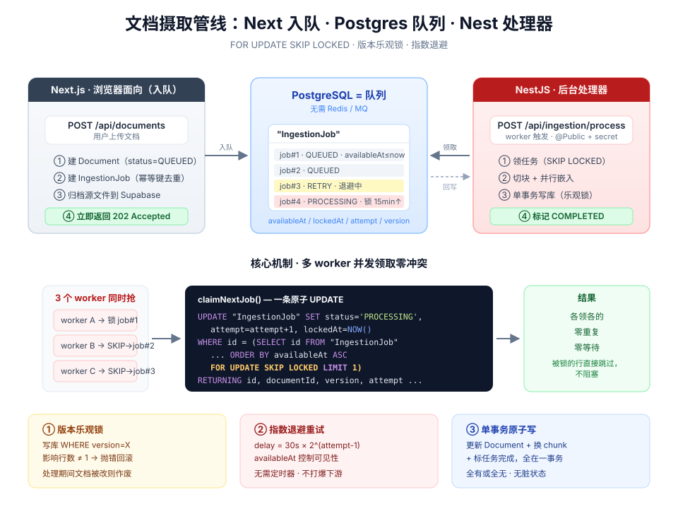

# 在 NestJS 里重建摄取管线：一个生产级并发任务队列的解剖

> 代码仓库：[next-mobile](https://github.com) | 核心实现：[`apps/api/src/ingestion/`](file:///Users/linruitao/Documents/100-study/200-reactjs/next-mobile/apps/api/src/ingestion)

这是 Next.js → NestJS 迁移系列的一片。检索栈迁完之后，轮到**文档摄取管线**：把用户上传的文档切块、嵌入、写进 pgvector。它比检索更棘手——检索是无状态的读，摄取是**有状态、可失败、需并发**的写。这篇拆两件事：

1. 一个能扛多 worker 并发的任务队列，核心就三招：`FOR UPDATE SKIP LOCKED`、版本乐观锁、指数退避。
2. NestJS 的依赖注入和模块化，在这套逻辑外面提供了什么。



---

## 为什么摄取要做成"任务队列"？

最朴素的做法是：用户点"上传"，请求里同步切块 + 嵌入 + 写库，处理完再返回。**这在生产环境会崩**，原因有三：

| 问题 | 同步处理 | 队列处理 |
|------|---------|---------|
| **耗时** | 嵌入一篇长文档要调好几次 API，用户干等十几秒 | 入队即返回 `202`，后台慢慢跑 |
| **失败** | API 抖一下，整个上传失败，用户重传 | 任务标记 `RETRY`，退避后自动重试 |
| **削峰** | 100 人同时传，100 个嵌入请求打爆下游 | worker 按 `limit` 匀速消费 |

所以架构拆成两半：

```
┌─── Next (浏览器面向) ───┐        ┌─── Nest (后台处理) ───┐
│  POST /api/documents    │        │  POST /api/ingestion   │
│  → 建 Document (QUEUED)  │        │       /process         │
│  → 建 IngestionJob      │  ───►  │  → 领任务               │
│  → 返回 202             │  队列  │  → 切块 + 嵌入 + 写库    │
└─────────────────────────┘  (DB) │  → 标记 COMPLETED       │
                                   └────────────────────────┘
```

**入队**留在 Next（它绑定浏览器会话），**处理器**搬到 Nest。数据库里的 `IngestionJob` 表就是队列本身——不引入 Redis、不引入 MQ，**Postgres 自己就是队列**。下面会看到这怎么做到的。

---

## 一、DI 与模块：Nest 给了什么骨架

先看 Nest 侧的文件结构，四类角色：

| 文件 | 角色 | 装饰器 | 类比 Next |
|------|------|--------|-----------|
| `chunking.ts` | 纯函数 | 无 | `lib/chunking.ts` |
| `embedding.service.ts` | Provider | `@Injectable()` | `lib/embedding.ts` |
| `ingestion.service.ts` | Provider | `@Injectable()` | `lib/ingestion.ts` |
| `ingestion.controller.ts` | Controller | `@Controller()` | `app/api/ingestion/process/route.ts` |
| `ingestion.module.ts` | Module | `@Module()` | 无（Next 靠文件系统） |

核心差别：**Next 靠 `import` 抓依赖，Nest 靠构造函数声明依赖、由容器注入。**

```ts
// ingestion.service.ts
@Injectable()
export class IngestionService {
  constructor(
    private readonly prisma: PrismaService,       // ← 我需要 Prisma
    private readonly embeddings: EmbeddingService, // ← 我需要嵌入服务
  ) {}
}
```

你从不写 `new IngestionService(...)`。启动时容器看到构造函数的参数类型，自己找到已注册的单例塞进来。整个 app 共用**同一个** `PrismaService`（同一个连接池），这对数据库密集的摄取任务很关键——不会每个请求开新连接。

`PrismaService` 甚至不用在本模块声明，因为它来自一个全局模块：

```ts
// database/database.module.ts
@Global()                                       // ← 全局可注入，免 import
@Module({ providers: [PrismaService], exports: [PrismaService] })
export class DatabaseModule {}
```

最后 `ingestion.module.ts` 是"装配说明书"，`app.module.ts` 把它挂上——不挂，容器就不认识它。这一层显式声明是 Next 没有的心智负担，但换来依赖关系可见、可测试、单例统一。

> 迁移纪律：这一片**只搬处理器，不切流量**。Next 仍是唯一活跃路径，Nest 并行存在，URL 对齐成 `/api/ingestion/process`，日后切换只需改 worker 指向。

---

## 二、原子领取：`FOR UPDATE SKIP LOCKED`

来到真正的技术核心。假设你同时跑 3 个 worker 抢同一个队列，**绝对不能两个 worker 领到同一个任务**。这靠一条 SQL 解决（[`ingestion.service.ts`](file:///Users/linruitao/Documents/100-study/200-reactjs/next-mobile/apps/api/src/ingestion/ingestion.service.ts)）：

```sql
UPDATE "IngestionJob"
SET "status" = 'PROCESSING', "attempt" = "attempt" + 1, "lockedAt" = NOW(), ...
WHERE "id" = (
  SELECT "id" FROM "IngestionJob"
  WHERE (
    ("status" IN ('QUEUED','RETRY') AND "availableAt" <= NOW())
    OR ("status" = 'PROCESSING' AND "lockedAt" < ${staleBefore})
  )
  AND "attempt" < "maxAttempts"
  ORDER BY "availableAt" ASC, "createdAt" ASC
  FOR UPDATE SKIP LOCKED          -- ★ 灵魂在这一行
  LIMIT 1
)
RETURNING "id", "documentId", "userId", "documentVersion", "attempt", ...
```

拆解 `FOR UPDATE SKIP LOCKED`：

- **`FOR UPDATE`**：SELECT 选中的行加**行级写锁**，别的事务想锁同一行得排队。
- **`SKIP LOCKED`**：但我不排队——**已被别的 worker 锁住的行直接跳过**，找下一个空闲的。

于是三个 worker 同一瞬间执行：

```
worker A  → 锁住 job#1，拿走
worker B  → job#1 被锁，SKIP → 拿到 job#2
worker C  → job#1、#2 都被锁，SKIP → 拿到 job#3
```

**各领各的，零冲突、零重复、零等待。** 没有 `SKIP LOCKED`，B 和 C 会阻塞等 A 释放锁，吞吐直接塌。这是 Postgres 当任务队列用的标准手法。

还有个细节：整个"选行 + 加锁 + 改状态 + `attempt+1` + 盖 `lockedAt` 时间戳"是**一条 UPDATE 原子完成**，`RETURNING` 把领到的字段吐回给 JS。没有"先查后改"的窗口期。

> 这就是为什么这段必须是**原生 SQL**，不能用 Prisma ORM。`findFirst` + `update` 是两步，中间的窗口期里两个 worker 可能都 `findFirst` 到同一行，原子性碎掉。ORM 好用，但表达不了 `SKIP LOCKED`。

### 顺带一招：僵尸任务自愈

领取之前还有一段：如果某 worker 领了任务、标成 `PROCESSING` 然后**进程崩了**，任务会永远卡住。所以先扫一遍"锁超过 15 分钟且重试耗尽"的僵尸任务，判死刑：

```sql
UPDATE "IngestionJob" SET "status" = 'FAILED', ...
WHERE "status" = 'PROCESSING'
  AND "lockedAt" < ${staleBefore}     -- now - 15min
  AND "attempt" >= "maxAttempts"
```

队列自己会清理崩溃留下的烂摊子，无需人工干预。

---

## 三、版本乐观锁：处理过程中文档被改了怎么办？

领到任务开始处理。但嵌入调用很慢（好几秒），这期间用户可能又**编辑**了这篇文档（触发 reindex，`version + 1`）。你正在嵌入的是**过时内容**。

第一道防护，进门先校验版本：

```ts
const document = await this.prisma.document.findFirst({ where: { id: job.documentId, userId: job.userId } })
if (!document || document.version !== job.documentVersion) {
  await this.markCancelled(job.id, "Document was deleted or superseded by a newer version")
  return { jobId: job.id, status: "CANCELLED" }
}
```

但从这里到写库还有几秒。第二道防护在写库的 `UPDATE` 里带上**版本条件**，检查影响行数：

```ts
await this.prisma.$transaction(async (tx) => {
  const updated = await tx.$executeRaw`
    UPDATE "Document"
    SET "embedding" = ${documentEmbeddingString}::vector, "status" = 'READY', ...
    WHERE "id" = ${document.id} AND "userId" = ${job.userId}
      AND "version" = ${job.documentVersion}          -- ← 版本没变才更新
  `
  if (updated !== 1) throw new StaleIngestionJobError("Document version changed during indexing")
  // ↑ 影响行数不是 1，说明干活期间版本被人改了 → 抛错 → 整个事务回滚

  await tx.$executeRaw`DELETE FROM "DocumentChunk" WHERE "documentId" = ${document.id}`
  for (const chunk of chunks) { /* INSERT 新 chunk + embedding */ }
  await tx.ingestionJob.update({ where: { id: job.id }, data: { status: "COMPLETED", ... } })
})
```

这就是**乐观锁**：不预先锁行，提交时才检查"我读到之后有没有人动过"。`WHERE version = X` 影响 0 行，就知道版本变了，回滚。

而且整个更新 Document + 删旧 chunk + 插新 chunk + 标任务完成，全在**一个事务**里——要么全成，要么全滚。绝不会出现"Document 标了 READY 但 chunk 只插一半"的脏状态。

---

## 四、指数退避：失败了怎么重试

`catch` 块区分两类失败：

```ts
if (error instanceof StaleIngestionJobError) {   // 版本冲突 → 内容过时，重试无意义
  await this.markCancelled(job.id, error.message)
  return { jobId: job.id, status: "CANCELLED" }
}

const terminal = job.attempt >= job.maxAttempts
const retryDelay = BASE_RETRY_DELAY_MS * Math.pow(2, Math.max(0, job.attempt - 1))
//                 30s * 2^(attempt-1)  →  30s, 60s, 120s ...
```

- **版本冲突**：重试也是嵌入旧内容，直接作废。
- **真失败**（嵌入 API 挂了）：没到上限标 `RETRY`，把 `availableAt` 设到 `now + retryDelay` 的未来——退避期内领取 SQL 的 `availableAt <= NOW()` 条件不满足，任务自动"隐身"；到上限标 `FAILED`。

`Math.pow(2, attempt-1)` 就是**指数退避**：失败越多次等越久。下游已经过载了，你还每 30 秒猛捶它只会雪上加霜；退避给它喘息时间。

注意这里的巧妙——**退避不需要定时器**。任务的可见性由 `availableAt` 字段 + 领取 SQL 的 `WHERE` 条件天然实现。队列的一切状态都在数据库里。

---

## 五、Controller 与 Guard：认证怎么处理

Nest 有**全局** `SupabaseAuthGuard`，每个请求默认过 Supabase token 认证。但摄取端点是 worker 调的，没有登录用户。用 `@Public()` 跳过全局认证，再自己校验 worker secret：

```ts
@Controller("ingestion")
export class IngestionController {
  constructor(private readonly ingestion: IngestionService) {}

  @Public()                     // ← 元数据标签，Guard 读到就放行
  @Post("process")
  async process(@Headers("authorization") authorization: string | undefined, @Body() body: unknown) {
    if (!process.env.INGESTION_WORKER_SECRET)
      throw new ServiceUnavailableException({ error: "Worker secret 未配置" })   // → 503
    if (!this.hasValidWorkerSecret(authorization))
      throw new UnauthorizedException({ error: "未授权" })                        // → 401

    const request = ProcessIngestionRequestSchema.parse(body ?? {})   // Zod 校验
    const results = []
    for (let i = 0; i < request.limit; i++) {
      const result = await this.ingestion.processNextIngestionJob()
      if (!result) break        // 队列空了，提前停
      results.push(result)
    }
    return { processed: results.length, results }
  }
}
```

两个值得说的点：

**① `@Public()` 是"元数据 + Reflector"模式。** 它只往方法上贴个 `isPublic=true` 标签，Guard 用 `Reflector` 读标签决定放不放行。装饰器贴标签、横切组件读标签——这是 Nest 处理认证/日志这类横切关注点的通用套路。

**② worker secret 用常量时间比较防时序攻击：**

```ts
if (!expected || !supplied || expected.length !== supplied.length) return false
return timingSafeEqual(Buffer.from(expected), Buffer.from(supplied))
```

不用 `===`，因为普通字符串比较发现第一个不同字符就返回，攻击者能靠测量响应时间逐字符猜密钥。`timingSafeEqual` 无论哪里不同都花同样时间。

还有个 Nest 习惯：**用 `throw XxxException` 代替 `return Response(status)`**。Service 层能直接抛业务异常，Nest 的全局异常过滤器负责翻译成 HTTP 状态码，不用把 `Response` 对象一层层往上传。

---

## 完整数据流（一图收尾）

```
worker  POST /api/ingestion/process  Bearer <secret>  { limit: 2 }
  │
  ▼ [Middleware] 记开始时间，response.on("finish") 挂耗时日志
  ▼ [Guard] 见 @Public() → 跳过 Supabase 认证
  ▼ [Controller] 验 worker secret → Zod 校验 → 循环 limit 次
  ▼ [Service.claim]   FOR UPDATE SKIP LOCKED 原子领一个任务（多 worker 不打架）
  ▼ [Service.process] 版本校验 → 并行嵌入 → 事务(乐观锁更新 + 换 chunk + 完成) → 失败则指数退避
  ▼ [Prisma] ORM + 原生 SQL 混用，单例连接池
  ▲ [Middleware] finish 触发 → 打印 "POST /api/ingestion/process 200 843ms"
```

---

## 总结

这一片真正有含金量的不是 Nest 本身，而是**用一张数据库表实现一个正确的并发任务队列**：

| 需求 | 解法 |
|------|------|
| 多 worker 不抢同一任务 | `FOR UPDATE SKIP LOCKED` 原子领取 |
| worker 崩了任务不卡死 | stale-lock 超时回收，自愈 |
| 处理期间文档被改 | 版本乐观锁（`WHERE version = X`，影响行数校验） |
| 写库不出脏状态 | 单事务，全有或全无 |
| 失败不打爆下游 | 指数退避，`availableAt` 控制可见性 |
| 不引入 Redis/MQ | Postgres 表即队列 |

而 NestJS 提供的 **DI、全局 Guard、模块化、异常映射**，让你能把注意力全放在上面这张表上——脚手架是声明式的、复用的，业务难点是你自己的。这套并发功底和框架无关，你在任何语言里写 worker 都用得上。

---

## 下阶段

- **Ingestion Cutover**：加 flag 让 worker 指向 Nest，parity 稳定后退役 Next 处理器。
- **运行时 parity 验证**：同一文档分别经 Next / Nest 处理器，比对分块数、`chunkingVersion` / `parserVersion` / `embeddingModel` 与 chunk 的 offset / heading。
- **可观测性**：把 `requestId` 贯穿 worker → Nest → 嵌入调用，结构化日志记录任务耗时与重试次数。
